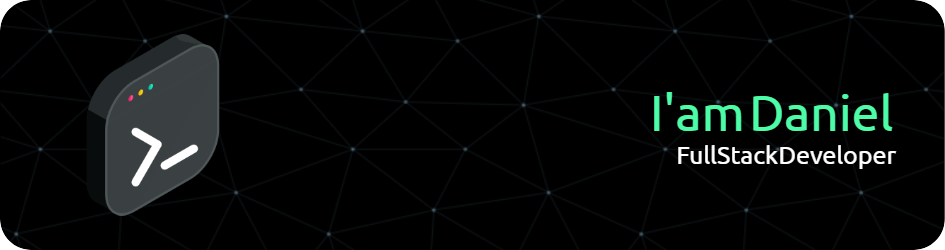

### Hi there `I'm Daniel` 👋 
like the software I like to work on myself as a version now I am on my version 3 (bode v3.0) :smiley: :computer:

- 🔭 I’m currently working on ... I'm looking for Job
- 🌱 I’m currently learning c++ and Vue js
- 👯 I’m looking to collaborate on frontend and backend projects (python, node and react)

### Contact me!
- :mailbox: dga500@hotmail.com
- [ LinkedIn](https://www.linkedin.com/in/daniel-gonzalez-avila-75770b234)
&nbsp;
 

### Databases

### BackEnd

### FrontEnd

### Testing

### DevOps & Version Control

 
 

